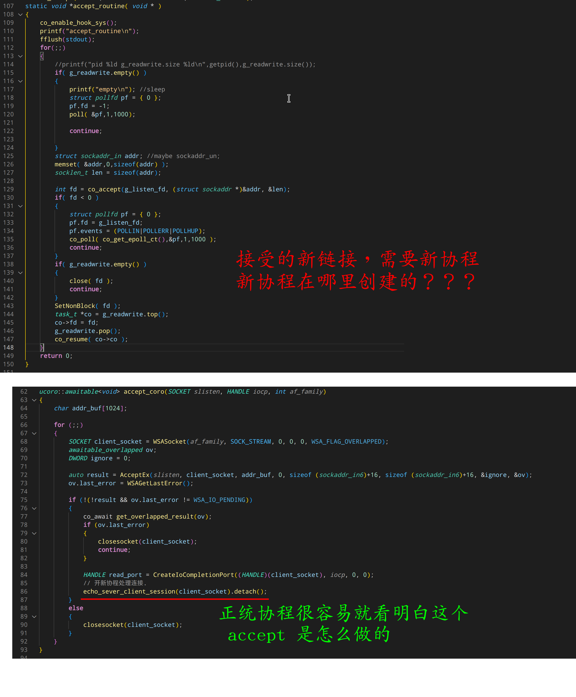

# 序

libco 是 腾讯开源的一个协程库。噱头很大，动不动就是承载了微信后台亿万并发。
敢说个不马上被喷成狗头。但是我偏就是要对这些光有名头没啥技术的东西祛魅。

[上一片文章](https://microcai.org/2024/12/16/dig-into-coroutine-lib.html) 里，点评了云风的 coroutine库，其中提到了 libco 犯了和云风一样的错。

其实 libco 的错误要比云风还要多的多。

废话不多说，接下来点评 libco


# libco 错在哪里

首先错误的，仓库上一篇，他和云风的错误是一样的。表述相同的部分就不特别说明了。

## 1 协程库不应该干涉程序结构

但是 libco 的此进入非彼侵入。云风的侵入，是需要永久性的携带 `struct schedule *S`,
而 libc 的侵入，则是，它根本就不让你正常的用阻塞的思维模式设计你的代码结构。

我们那它源码里自带的 example_echosrv.cpp 举例


这是它一个建议的 echo server。前面介绍 iocp4linux 的时候，我就贴过正统代码。
算了，还是直接给个对比吧。




图片里两端代码，下面的是正统协程库写的 echo server 里的 accept 循环。
而上面那段则是 libco 里的例子。

正如我图片里的吐槽那样，腾讯的 libco 在编写代码的时候，很容易陷入不知所谓的境地。

这就是因为它库设计的缺陷，所以必须要用很绕的方式组织代码逻辑。

## 2 协程库不应该强依赖一个调度器

还是刚刚腾讯自己写的 example_echosrv.cpp 例子。
这次是 main 函数。


这不仅仅是依赖调度器了，这是必须，也只能使用 libco 的事件循环。

如果云风的库只能算对你壁咚，那腾讯的库就是把你裤子都扒光了后入。

> 当然，不可否认一些人有网红膜拜症，非要被玩一把才开心。

当然，如果他的库已经实现的比较完善，那么使用他的事件循环，调用他封装好的 IO api，也未尝不可以接受。神神曾经说过，被强奸的时候，反抗不了，就要学会享受。

在这点上，云风尚且比腾讯强一丢丢。他的协程库尚且知道，协程库只做协程。IO应该使用另外的 IO库。协程库要做的，就是辅助你使用 IO库的时候，让你写异步IO的代码写的行云流水。

然而 libco 则是包办一切。试图统括协程调度和异步IO。
想一个库包办一切，自然代价就是，啥也干不好。

## 3. M:N 模型是一个已经在上世纪就被证明是个废物

libco 实际上实现的不是协程，而是一种用户线程，并且使用了 M:N 机制进行调度。

所谓 M:N 机制，是指用 N 个内核调度实体（也就是线程），去调度 M 个 协程。

实际上 M:N 模型在上世纪，是 1:1 的 posix thread 模型的有力竞争对手。
并差一点成为 Linux 上的标准线程库。

要实现 M:N 模型，就需要在每个可能的地方插入“调度点”。
所谓调度点，就是在这个点上，当前运行的协程会被挂起，然后运行其他“就绪”状态的协程。

为了避免协程长时间占有cpu资源，M:N 模型通常会设计在“所有”的系统api上设计调度点。

这听起来好像很牛逼的线程模型啊！咋的后来被干掉了呢？

因为这个模型是假设内核创建线程的开销是很大很大的。于是通过 M:N 的映射关系，将用创建的大量用户级线程，给映射到较少量的内核线程上。

但是由于调度点的存在，这种线程模型大大增加了线程库的复杂度。并且由于仍然是多线程架构，意味着用户的代码还是得和多线程一样，需要加锁，搞同步。。而且还不能使用内核本身提供的线程间的同步机制。

大大增加了心智负担，而其所假定的”内核的线程开销比较大“这个前提，禁不起实践的考验。

最终实现 1:1 模型的 pthreads 将 M:N 模型扫地出门。

> 几十年后，还未进棺材的老古董，被 google 重新启用开发了 go ，go 就使用了 M:N 线程模型。但是却谎称是协程。坑了无数刚入门的小白。

正因为 libco 实际上就是 M:N 模型的线程库，所以他才需要不辞辛劳的对系统 api 进行 hook。

## 4. 明明是个 C++ 库，却不支持正统 c++ 的用法

云风的库，其协程函数的入口点是固定签名，带 void* 参数用以支持用户传他自定义的参数。
这是 C 语言的缺陷。只能这么办。

但是，腾讯你写个 c++ 库，好歹学习一下 std::thread 标准库的接口啊。

我都用 c++ 了，还用 void* ，那我不是白用 c++ 了？

这个可不能用设计来搪塞了。这实际上就是无能的表现。

因为设计为接受 任意多参数作为协程入口。需要使用高级模板技巧。

学不会的人就会以**太复杂了**为由搪塞。实际上并不复杂。而且能大幅降低接口的使用难度。

来，我现场改一个，让 co_create 可以支持入口函数为任意参数


这里面的道道，恐怕他们十年也不一定看得懂。

虽然其实很简单。根本没有增加任何代码复杂度。以“要维持代码简单”为借口是完全没有根脚的。

因为本质上， libco 是一群 C with class 程序员写的。C with class 程序员最大的特点就是无能。
把学不会的东西硬说成是不需要的东西。

## 5. 上下文切换到底要切些什么都不知道

来看下 libco 里执行上下文切换的汇编代码


可以看出来，它把 “所有” 的 **通用寄存器** 都切换了。
然而，没有切换状态寄存器，没有切换浮点寄存器。

好吧，你是说它为了性能，禁止了浮点使用。

那既然为了性能，又为何对x86 调用约定里直白的写不需要保存的寄存器进行切换了呢？

为何不需要保留 x86 调用约定规定的易失性寄存器呢？

因为这个协程切换，是主动进行的切换。是**主动调用**了 coctx_swap 产生的切换。

具体的来说，是在 co_coroutine.cpp 里，co_swap（） 调用了：

```c
coctx_swap(&(curr->ctx),&(pending_co->ctx) );
```


coctx_swap 执行成功后，程序就切换走了。但是，某一天当前协程被恢复了，那么这个 coctx_swap 又会**神奇**的返回了。

就好像 setjump() 那样。

那么对于编译器来说，它本来就会指导，一旦调用了 coctx_swap, 那么编译器就得假定 coctx_swap 返回后，有数个寄存器的内容是已经破坏了。如果编译器需要这些寄存器的内容被保留，编译器在生成 coctx_swap 调用前，就会先行 保存这些寄存器的数值。

这就是x86调用约定里，关于 "**易失性寄存器**" 的约定。

而 libco 的作者一股脑的全恢复了，说明 libco 的作者根本没有深入去思考协程上下文切换。
所谓的高性能，不过是它偷懒没有切换 浮点寄存器和状态寄存器。

而这种偷懒，一定会有代价。那就是 使用 libco ，就不得不禁止使用 浮点数和 异常。

是的，连异常都要被禁止。否则协程就会发生未定义行为。

当然，浮点也不是说完全不能使用。浮点可以在不跨 **调用点** 的场合下使用。

也就是说，函数内部没有调用 libco 的 API 的情况下，可以使用浮点。函数内部有调用 libco api 的情况下，浮点的使用要维持在 要么是调用前，要么只能在调用后。不能跨调用点使用。

> 其实云风的错误，之所以比 libco 少，完全是因为写的代码少。你看它鸡贼的使用了 ucontext api ，从而避开了
底层汇编进行 cpu 上下文切换的工作。


# 总结

其实 libco 是一个相当的 “玩票” 性质的库。但是因为套了一个“腾讯”的名头，就被很多人顶礼膜拜。

这篇文章发出去，可以遇见的是徒子徒孙门都会过来骂我。为了维护他们心中的那个 **信仰**。


OVER

